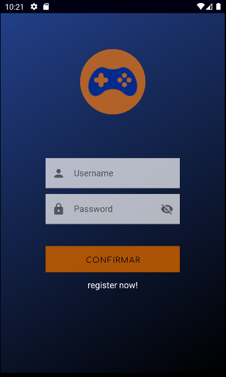
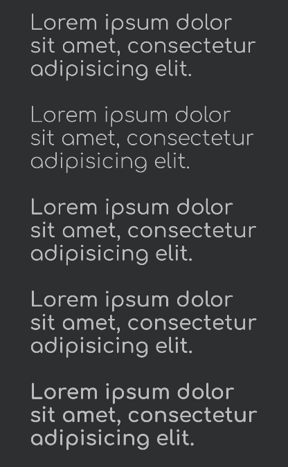
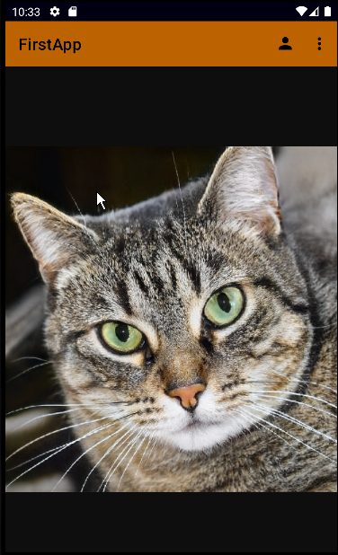
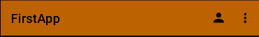
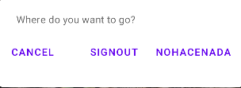
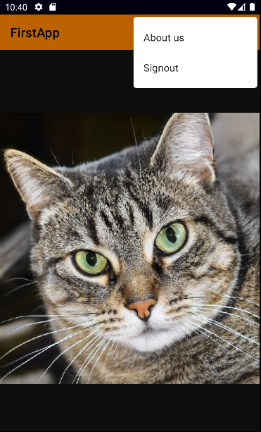
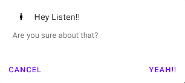
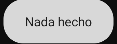
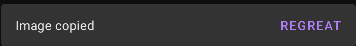
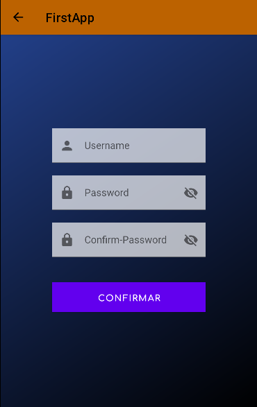

# FirstApp

Gif resumen de la aplicación.
##Icono
El icono es un pequeño mando azul con un fondo en un tono naranja tirando a oscuro.

##Colores
Los colores base utilizados en esta aplicacion son el azul(#223F88) y el naranja(#FA9A34) siendo este último el secundario.
##Splash
Lo primero que encontramos al abrir la aplicación es un fondo animado de "*nyancat*" junto con el icono y nombre (aún no oficial) de la app. 

mientras que continu el fondo animado de nyancat hay una animacion de escalado y de rotación en el icono, invitandote a entrar.
##Login
La primera activity que vemos es la de login, una interfaz básica con dos campos editables (uno de usuario y otro de introducir contraseña) con un botones  facilmente distingible (confirmar) y un texto (register now!) que tiene la función de otro botón.

También podemos observar el fondo, que no destaca mucho (no es su función), pero deja un rastro un tanto elegante, es un gradient que esta determinado desde el azul hasta el negro.

En esta ventana tambien encontramos los primeros rastros de la tipografía ubicados en el botón Comfortaa.

##Main
Al rellenar los datos (o no) y hacer click en confirmar nos envía al main de la aplicación.

Aqui ya podemos ver el verdadero propósito de mi app, y es ver gatitos, muchos y cuantos mas mejor, esta enlaza mediante un web view a una web que genera imagenes de gatos aleatorias e infinitas.
###AppBar
Encima de nuestras fotos de gatitos vemos una barra horizontal de tono anaranjado la cual contiente el nombre de la app, y un pequeño menú.

Si clickamos en la personita de arriba a la derecha, se abre una alerta en cual nos da tres opciones bastantes descriptivas por sus titulos.

Al hacer click en los tres puntitos de arriba a la derecha se nos abre otro menu el cual nos da otras opciones.

La opcion de signout nos abre una alerta[alerta](AlertP) parecida a la descrita anteriormente.

Muchas de estas opciones como descargar, about us ... nos muestra un pequeño toast ubicado en la parte inferior de la pantalla.

###Otras funciones
En el main tambien puedes mantener pulsado para que te salga otra alerta la cual te da las opciones de copiar o descargar.

al seleccionar copiar, se nos habrira una snackbar con la cual podemos deshacer los cambios de forma sencilla.

##Signup
Tanto en el boton de "*register now!*" como si clickamos en los multiples signout nos llevara a la activity de registro, la cual consta de tres campos editables, el mismo botón y el mismo gradient de fondo que en la pestaña login.

##Autor
Alejandro Martín, estudiante de desarrollo de aplicaciones multiplataforma en el IES Juan de la Cierva.
